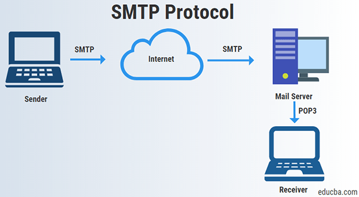

# email-sender-rpa
 Automação de envio de e-mails com suporte a configuração personalizada e anexos em Python.

## Explicação do protocolo `Simple Mail Trensfer Protocol (SMTP)` usando nesse automação para envio de e-mail

O SMTP é uma protocolo de comunicação, ele é usado para enviar e receber mensagens de e-mial pela internet.

O SMTP funciona da seguinte forma: O `cliente de e-mail` do remetente age como `cliente SMTP` e transmite o e-mail para o `servidor SMTP` do remetente. Esse servidor porcessa a `mensagem ` e encaminha para o proximo serviço `Destinatário`, até atingir o servidor de e-mail final.

Ao chegar ao servidor do destinatário, o e-mail é entregue na caixa de entrada unsando protocolos com o IMAP ou POP.
O SMTP cuida mais precisamente do envio, enquanto POP/IMAP gerenciam o recebimento da mensagem do usuário.

Imagem de como é o fluxo do protocolo.

## Criando uma senha de aplicativo no gmail.

Acesse a sua conta do google e vá para a parte de `Segurança` e ative a `Verificação de 2 etapas`. Pode ir direto [clicando aqui](https://myaccount.google.com/security?utm_source=OGB&utm_medium=app)

depois coloque na barra de busca `Palavras-passe de apps` e então vai abrir uma janela com a senha `Copie ela porque depois você não poderá mais vela novamente`, enseguida coloque o gmail e a senha no codigo.